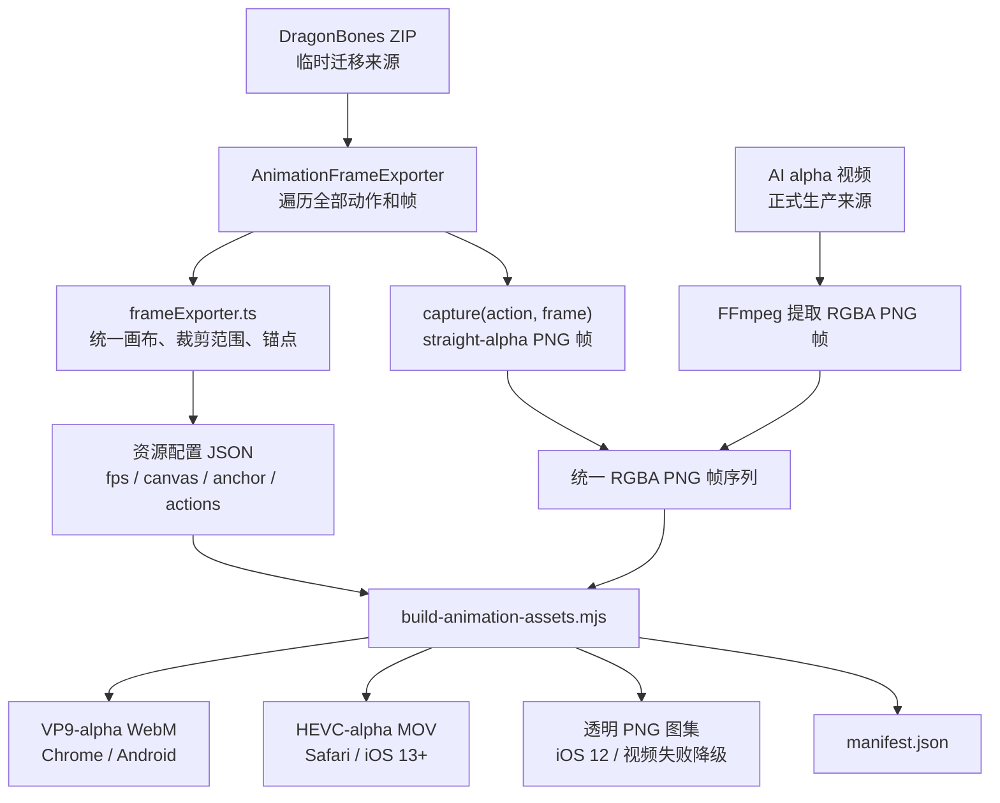

# 动画视频生成全流程

本文档独立说明动画数据源、RGBA 帧标准化、三种交付资源生成、manifest 构建以及浏览器运行时选型。工具的快速调用方式和目录约定参见同目录 `README.md`。

当前 DragonBones 导出仅用于没有 AI alpha 视频样例时的一次性迁移；正式生产流程以 AI alpha 视频为输入，最终模板运行时不依赖 DragonBones。

## 1. 数据源定位

当前存在两种上游数据源：

- 临时 DragonBones 迁移输入：`src/pages/animations/frameExporter.ts` 负责计算统一画布、裁剪范围、锚点和位移；`AnimationFrameExporter.capture()` 负责输出 straight-alpha PNG 像素。
- 正式 AI 输入：AI 生成的 alpha MOV、WebM 或 MP4，由生成工具先提取为 RGBA PNG 帧。

因此，`frameExporter.ts` 是当前 DragonBones 转视频路径的几何数据源头，但不是直接写出视频的模块。三个交付格式共同的标准转码中间输入是 RGBA PNG 帧序列。未来使用 AI alpha 视频时，会绕过 DragonBones 导出阶段。



## 2. DragonBones 临时帧导出

访问动画导出地址：

```text
/src/pages/animations/index.html?export=BD_laki.zip
```

导出页面执行以下工作：

1. 从 DragonBones 获取动作列表、帧数、时长和帧率。
2. 遍历每个动作的每一帧，通过 `measureCurrentBounds()` 收集可见边界。
3. `buildExportGeometry()` 合并全部边界并计算一套共享几何信息。
4. 调整 Canvas 尺寸和显示位移。
5. 通过 `window.__dragonBonesFrameExporter` 暴露元数据和 `capture(actionName, frame)`。

共享几何信息包括：

```ts
{
  canvas: { width, height },
  anchor: { x, y },
  transform: { x, y },
  sourceBounds
}
```

其中始终满足：

```text
anchor + transform = 原模板坐标 origin
```

这保证裁剪后的帧放回模板时保持原来的视觉位置，也避免不同动作切换时因画布变化产生跳动。

`capture()` 调用 `canvas.toDataURL('image/png')` 输出 straight-alpha PNG。导出器使用 `transparentMode="notMultiplied"`，不应在此阶段预乘 alpha：WebM 和 PNG 图集直接使用 straight alpha，只有 MOV 分支在编码前单独执行 premultiply。

当前仓库尚未包含把浏览器中的 `window.__dragonBonesFrameExporter` 自动保存成磁盘目录的完整脚本；这一步需要一次性浏览器自动化或手动调用。目标目录结构为：

```text
<source-root>/
  BD_laki/
    enter/
      frame-0001.png
      frame-0002.png
    wait/
      frame-0001.png
      ...
```

## 3. 资源配置

每个资源使用一个 JSON 配置，例如 `configs/BD_laki.json`：

```json
{
  "asset": "BD_laki",
  "fps": 24,
  "canvas": { "width": 186, "height": 214 },
  "anchor": { "x": -111.97000122070312, "y": 34.66999816894531 },
  "actions": [
    { "name": "enter", "frameCount": 18, "loop": true }
  ]
}
```

- `canvas`、`anchor` 来自帧导出器或 AI 资源制作元数据。
- `frameCount`、`fps` 描述标准化后的帧序列。
- `loop` 控制交付播放器是否循环。
- 动作可通过 `source` 显式指定输入路径。

## 4. 输入解析与标准化

`build-animation-assets.mjs` 按以下顺序寻找每个动作的输入：

1. 动作配置中的 `source`。
2. `<source-root>/<asset>/<action>/` PNG 帧目录。
3. `<source-root>/<asset>/<action>.mov`。
4. `<source-root>/<asset>/<action>.webm`。
5. `<source-root>/<asset>/<action>.mp4`。

PNG 目录必须包含连续命名的 `frame-0001.png`、`frame-0002.png` 等文件，数量必须等于 `frameCount`。工具使用 ffprobe/FFmpeg 校验第一帧尺寸和 alpha 通道。

视频输入会先转换为临时帧序列：

```text
fps=<配置帧率>,format=rgba
```

后续 WebM、MOV 和图集始终从同一套 RGBA PNG 帧生成。

## 5. manifest 生成

`build-animation-manifest.mjs` 为每个动作计算：

```text
duration = frameCount / fps
```

单帧动作只生成 PNG：

```json
{
  "frameCount": 1,
  "duration": 0.041666666666666664,
  "loop": false,
  "still": "end.png"
}
```

多帧动作生成 WebM、MOV 和图集描述：

```json
{
  "frameCount": 18,
  "duration": 0.75,
  "loop": true,
  "webm": "enter.webm",
  "mov": "enter.mov",
  "atlases": []
}
```

图集以 2048px 为最大边长，自动计算列数、行数、分页数量和每页起始帧。

## 6. VP9-alpha WebM

WebM 使用以下参数：

```text
libvpx-vp9
yuva420p
auto-alt-ref=0
crf=30
b:v=0
无音频
```

用于 Chrome 56+、Android 9 Chrome 以及其他支持 VP9 alpha 的非 Safari 浏览器。

## 7. HEVC-alpha MOV

MOV 使用以下处理链：

```text
crop=trunc(iw/2)*2:trunc(ih/2)*2
premultiply=inplace=1
format=bgra
hevc_videotoolbox
alpha_quality=1
tag=hvc1
无音频
```

- `crop` 显式把奇数尺寸裁为 HEVC 可稳定编码的偶数尺寸，避免 VideoToolbox 隐式缩宽造成 alpha 失真。
- `premultiply` 将 straight-alpha 中间帧转换为 Apple HEVC-alpha 默认使用的预乘模式，避免 Safari 合成时出现亮边或白边。
- `alpha_quality=1` 保留透明边缘；当前三个资源验证结果为 alpha 逐帧一致。
- `hvc1` 用于 Safari 和 iOS 的兼容播放。

该分支当前依赖 macOS VideoToolbox。`count` 的标准画布为 677×378，因此 WebM/PNG 保持 677×378，MOV 内部编码为 676×378，播放器仍按 manifest 的 677×378 显示。

## 8. 透明 PNG 图集

动态图集通过 FFmpeg `tile` 滤镜生成：

```text
tile=layout=<columns>x<rows>:nb_frames=<frameCount>:color=black@0
pix_fmt=rgba
```

图集用于 iOS 12、浏览器不支持目标视频格式、视频加载失败或播放失败时的降级路径。单帧动作直接复制为独立 PNG。

## 9. 输出安全性

生成工具拒绝已存在的输出目录。实际生成时先写入同级临时 staging 目录，所有动作和 manifest 都成功后，再整体重命名为正式目录。失败时清理 staging 目录和视频输入产生的临时帧，避免留下半套资源。

## 10. 模板加载与播放器选型

`src/pages/KJG_QAP_BD_v2_2026_video/rasterAssets.ts` 通过 `import.meta.glob` 加载 manifest 以及所有 WebM、MOV、PNG，并按资源名构造文件映射。

`RasterAnimationPlayer` 的自动选型规则为：

```text
iOS 12及以下
  → PNG 图集

Safari / iOS 13+
  → HEVC-alpha MOV
  → 不支持或失败时转 PNG 图集

Chrome / Android / 其他浏览器
  → VP9-alpha WebM
  → 不支持或失败时转 PNG 图集
```

播放器一次只设置一个视频 URL，不依赖 `<video><source>` 自动降级。`video.error` 或 `video.play()` Promise 被拒绝时，播放器保存当前 `currentTime`，主动切换到 Canvas 图集并从对应帧继续播放。

Canvas 图集播放器按照 `elapsedSeconds × fps` 计算帧号，按需加载分页图集，并使用 manifest 的 `canvas` 和 `anchor` 恢复资源尺寸及场景位置。

## 11. 当前流程边界

- DragonBones 导出只是没有 AI alpha 样例时的临时迁移输入，不属于最终模板运行时。
- 正式模板已经通过 WebM、MOV 或 PNG 图集播放迁移动画，不再依赖 DragonBones 播放这些资源。
- AI alpha 视频可以直接作为生成工具输入，但仍需要准确的 fps、帧数、画布和锚点配置。
- DragonBones 浏览器导出到磁盘帧目录目前尚未形成仓库内的一键命令。
- HEVC-alpha MOV 编码当前绑定 macOS；WebM 和 PNG 图集生成逻辑可跨平台运行。
