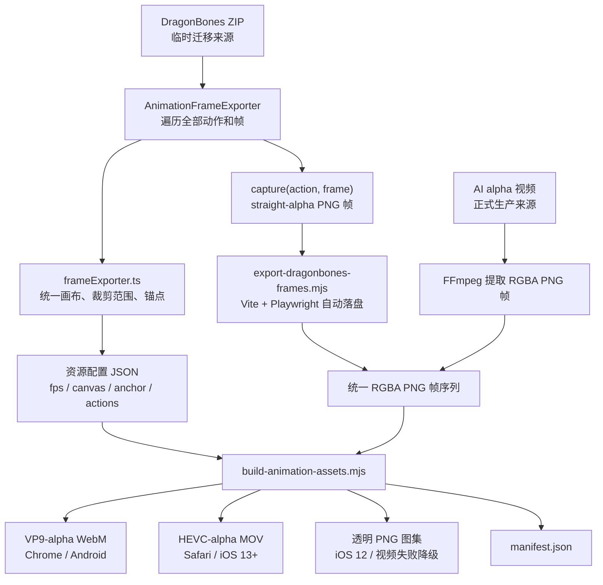

# 动画视频生成全流程

本文档独立说明动画数据源、RGBA 帧标准化、三种交付资源生成、manifest 构建以及浏览器运行时选型。工具的快速调用方式和目录约定参见同目录 `README.md`。

当前 DragonBones 导出仅用于没有 AI alpha 视频样例时的一次性迁移；正式生产流程以 AI alpha 视频为输入，最终模板运行时不依赖 DragonBones。

## 1. 数据源定位

当前存在两种上游数据源：

- 临时 DragonBones 迁移输入：`src/pages/animations/frameExporter.ts` 负责计算统一画布、裁剪范围、资源内在锚点和位移；`AnimationFrameExporter.capture()` 负责输出 straight-alpha PNG 像素。
- 正式 AI 输入：AI 生成的 alpha MOV、WebM 或 MP4，由生成工具先提取为 RGBA PNG 帧。

因此，`frameExporter.ts` 是当前 DragonBones 转视频路径的几何数据源头，但不是直接写出视频的模块。三个交付格式共同的标准转码中间输入是 RGBA PNG 帧序列。未来使用 AI alpha 视频时，会绕过 DragonBones 导出阶段。



## 2. DragonBones 临时帧导出

访问动画导出地址：

```text
/src/pages/animations/index.html?export=BD_laki.zip
```

导出页面执行以下工作：

1. 从 DragonBones 获取动作列表、帧数、时长和帧率。
2. 遍历每个动作的每一帧，通过 `measureCurrentBounds()` 收集可见边界。
3. `buildExportGeometry()` 合并全部边界并计算一套共享几何信息。
4. 调整 Canvas 尺寸和显示位移。
5. 通过 `window.__dragonBonesFrameExporter` 暴露元数据和 `capture(actionName, frame)`。

共享几何信息包括：

```ts
{
  canvas: { width, height },
  anchor: { x, y },
  transform: { x, y },
  sourceBounds
}
```

```text
assetAnchor = minBounds - exportPadding
assetAnchor + transform = 0

renderLeft = templateOrigin.x + assetAnchor.x
renderTop  = templateOrigin.y + assetAnchor.y
```

`assetAnchor` 是转换流程自动测量的资源属性；`templateOrigin` 是每个模板、每个使用位置自己的布局属性。二者分离后，同一份视频资源可以在不同模板位置复用，无需重新转换。全部动作仍使用同一套联合画布和 `assetAnchor`，避免动作切换时跳动。

`capture()` 调用 `canvas.toDataURL('image/png')` 输出 straight-alpha PNG。导出器使用 `transparentMode="notMultiplied"`，不应在此阶段预乘 alpha：WebM 和 PNG 图集直接使用 straight alpha，只有 MOV 分支在编码前单独执行 premultiply。

`export-dragonbones-frames.mjs` 会自行启动 Vite 和无头 Chromium，遍历 `src/pages/animations/assets`，把浏览器中的元数据、生成配置和 PNG data URL 原子写入磁盘。转换不读取模板位置或循环策略：

```sh
node tools/ai-animation/export-dragonbones-frames.mjs \
  /tmp/all-animation-frames \
  /tmp/all-animation-configs
```

输出目录结构为：

```text
<source-root>/
  BD_laki/
    enter/
      frame-0001.png
      frame-0002.png
    wait/
      frame-0001.png
      ...
```

当前全量导出结果为 14 个资源、63 个动作、2327 张透明帧。联合画布宽高会向上补齐为偶数，保证 WebM、MOV、PNG 和 manifest 使用完全相同的尺寸。

## 3. 资源配置

每个资源会自动生成一个中间配置。目标格式如下：

```json
{
  "asset": "BD_laki",
  "fps": 24,
  "canvas": { "width": 186, "height": 214 },
  "anchor": { "x": -111.97000122070312, "y": -210.33000122070312 },
  "actions": [
    { "name": "enter", "frameCount": 18 }
  ]
}
```

- `canvas`、`anchor` 来自帧导出器或 AI 资源制作元数据；`anchor` 只能表示相对资源原点的裁切偏移，不能包含模板 `origin`。画布宽高必须为偶数。
- `frameCount`、`fps` 描述标准化后的帧序列。
- 动作可通过 `source` 显式指定输入路径。

`configs/*.json` 是测量阶段的输出、编码阶段的输入，不是需要人工长期维护的预配置。批量迁移时生成到本次任务的临时工作目录，不提交到仓库。

### 3.1 转换与模板职责边界

| 信息 | 归属 | 产生方式 |
| --- | --- | --- |
| `fps` | 转换产物 | 从源动画、帧序列或 AI 视频自动读取 |
| `canvas` | 转换产物 | 合并全部动作帧边界后自动计算 |
| `frameCount` | 转换产物 | 自动统计标准化帧序列 |
| `anchor` / `assetAnchor` | 转换产物 | `minBounds - exportPadding` |
| `origin` | 模板逻辑 | 模板组件的布局常量或属性 |
| `loop` | 模板逻辑 | 模板状态机和播放器调用参数 |

转换工具不得根据模板位置修改视频像素、画布或资源锚点。模板播放器按以下方式组合两套信息：

```text
资源位置 = 模板 origin + manifest anchor
是否循环 = 模板本次播放调用的 loop 参数
```

### 3.2 原模板常量迁移规范

原 DragonBones 模板需要在运行时创建固定 Canvas。骨骼可能包含负坐标，且不同动作的可见范围不同；为防止 Canvas 裁切，模板会扩大 Canvas、移动骨骼 display，再用相反方向的 DOM 偏移抵消补白。

角色原实现等价于：

```text
Canvas DOM：left = -240，top = -120
骨骼 display：x = 240，y = 120 + slotTop

最终 x = -240 + 240 = 0
最终 y = -120 + 120 + slotTop = slotTop
```

因此 `240/120` 是 DragonBones Canvas 补偿，真正的模板布局只有 `slotTop`。离线转换已经完成所有帧的联合裁切，运行时不再需要同样的大 Canvas 和抵消量。

| 原常量或逻辑 | 迁移规则 |
| --- | --- |
| 场景 `left/top`、角色 `slotTop`、运动起终点 | 保留在模板 |
| 组件 viewport、视觉适配区域、缩放上限 | 保留在模板 |
| 仅用于防止 DragonBones Canvas 裁切的 padding | 删除，由离线联合裁切和 `exportPadding` 替代 |
| 由上述 padding 推导的 DragonBones Canvas 宽高 | 删除，由 `manifest.canvas` 替代 |
| 骨骼 display 位移与相反的 DOM Canvas 位移 | 删除，由 `manifest.anchor` 和模板 `origin` 组合替代 |
| 运行时骨骼 bounds 测量和 `fitPlayerToViewport` | 删除，使用 `manifest.canvas` 与模板目标区域计算缩放 |
| 定义实际视觉安全区的 padding，例如金币适配区域 | 保留在模板，不得因名称含 `padding` 而机械删除 |

判断标准：如果一个常量只参与 DragonBones Canvas 尺寸、骨骼 display 位移或相反方向的抵消，它是渲染补偿；如果它影响组件位置、运动路径、viewport、视觉安全区或缩放目标，它是模板逻辑。

## 4. 输入解析与标准化

`build-animation-assets.mjs` 按以下顺序寻找每个动作的输入：

1. 动作配置中的 `source`。
2. `<source-root>/<asset>/<action>/` PNG 帧目录。
3. `<source-root>/<asset>/<action>.mov`。
4. `<source-root>/<asset>/<action>.webm`。
5. `<source-root>/<asset>/<action>.mp4`。

PNG 目录必须包含连续命名的 `frame-0001.png`、`frame-0002.png` 等文件，数量必须等于 `frameCount`。工具使用 ffprobe/FFmpeg 校验第一帧尺寸和 alpha 通道。

视频输入会先转换为临时帧序列：

```text
fps=<配置帧率>,format=rgba
```

后续 WebM、MOV 和图集始终从同一套 RGBA PNG 帧生成。

## 5. manifest 生成

`build-animation-manifest.mjs` 为每个动作计算：

```text
duration = frameCount / fps
```

单帧动作只生成 PNG：

```json
{
  "frameCount": 1,
  "duration": 0.041666666666666664,
  "still": "end.png"
}
```

多帧动作生成 WebM、MOV 和图集描述：

```json
{
  "frameCount": 18,
  "duration": 0.75,
  "webm": "enter.webm",
  "mov": "enter.mov",
  "atlases": []
}
```

图集以 2048px 为最大边长，自动计算列数、行数、分页数量和每页起始帧。

`manifest.json` 当前版本为 v2，不包含 `origin` 或 `loop`。模板调用播放器时传入这两个参数；同一媒体资源不会因使用位置或循环策略不同而重新编码。播放器拒绝 v1 manifest，防止把曾经混入模板 origin 的旧 anchor 静默当作资源锚点。

## 6. VP9-alpha WebM

WebM 使用以下参数：

```text
libvpx-vp9
yuva420p
auto-alt-ref=0
crf=30
b:v=0
无音频
```

用于 Chrome 56+、Android 9 Chrome 以及其他支持 VP9 alpha 的非 Safari 浏览器。

## 7. HEVC-alpha MOV

MOV 使用以下处理链：

```text
crop=trunc(iw/2)*2:trunc(ih/2)*2
premultiply=inplace=1
format=bgra
hevc_videotoolbox
alpha_quality=1
tag=hvc1
无音频
```

- `crop` 是 HEVC 编码前的防御检查；当前导出器已把联合画布向上补齐为偶数，不再实际裁掉像素。
- `premultiply` 将 straight-alpha 中间帧转换为 Apple HEVC-alpha 默认使用的预乘模式，避免 Safari 合成时出现亮边或白边。
- `alpha_quality=1` 保留透明边缘；当前 14 个资源均已通过 alpha 解码审计。
- `hvc1` 用于 Safari 和 iOS 的兼容播放。

该分支当前依赖 macOS VideoToolbox。Intel QSV 不支持 Apple HEVC-with-alpha 的辅助 alpha 层，不能作为 Windows 等价替代；完整三格式构建应在 macOS 构建节点执行。

## 8. 透明 PNG 图集

动态图集通过 FFmpeg `tile` 滤镜生成：

```text
tile=layout=<columns>x<rows>:nb_frames=<frameCount>:color=black@0
pix_fmt=rgba
```

图集用于 iOS 12、浏览器不支持目标视频格式、视频加载失败或播放失败时的降级路径。单帧动作直接复制为独立 PNG。

## 9. 输出安全性

生成工具拒绝已存在的输出目录。实际生成时先写入同级临时 staging 目录，所有动作和 manifest 都成功后，再整体重命名为正式目录。失败时清理 staging 目录和视频输入产生的临时帧，避免留下半套资源。

配置参数指向目录时会按文件名排序批量构建全部资源：

```sh
node tools/ai-animation/build-animation-assets.mjs \
  /tmp/all-animation-configs \
  /tmp/all-animation-frames \
  /tmp/all-animation-raster
```

## 10. 模板加载与播放器选型

`src/pages/KJG_QAP_BD_v2_2026_video/rasterAssets.ts` 通过 `import.meta.glob` 加载 manifest 以及所有 WebM、MOV、PNG，并按资源名构造文件映射。

`RasterAnimationPlayer` 的自动选型规则为：

```text
iOS 12及以下
  → PNG 图集

Safari / iOS 13+
  → HEVC-alpha MOV
  → 不支持或失败时转 PNG 图集

Chrome / Android / 其他浏览器
  → VP9-alpha WebM
  → 不支持或失败时转 PNG 图集
```

播放器一次只设置一个视频 URL，不依赖 `<video><source>` 自动降级。`video.error` 或 `video.play()` Promise 被拒绝时，播放器保存当前 `currentTime`，主动切换到 Canvas 图集并从对应帧继续播放。

Canvas 图集播放器按照 `elapsedSeconds × fps` 计算帧号，按需加载分页图集，并使用 manifest 的 `canvas` 和资源 `anchor` 恢复裁切尺寸。模板另外提供 `origin` 和本次播放的 `loop`；视频与 Canvas 图集必须消费同一套模板播放参数。

## 11. 当前流程边界

- DragonBones 导出只是没有 AI alpha 样例时的临时迁移输入，不属于最终模板运行时。
- 正式模板已经通过 WebM、MOV 或 PNG 图集播放迁移动画，不再依赖 DragonBones 播放这些资源。
- AI alpha 视频可以直接作为生成工具输入，但仍需要自动产生准确的 fps、帧数、画布和资源锚点元数据。
- DragonBones 浏览器导出到磁盘帧目录已有一键命令；取得正式 AI 输入后，该临时入口可以停止使用，但无需改变下游生成器和播放器。
- HEVC-alpha MOV 编码当前绑定 macOS；WebM 和 PNG 图集生成逻辑可跨平台运行。

## 12. 验收边界

- WebM 自动验收：49 个动态动作可在 Chromium 播放，透明合成正常；循环、单次完成、暂停恢复和视频失败接续图集测试通过。
- PNG 自动验收：63 个动作都能通过分页图集或单帧 PNG 显示；强制图集和视频失败降级均不继续使用失败视频。
- WebM 与 PNG 对同一动作使用同一个 `canvas`、`anchor`、模板 `origin` 和 `loop`，关键非零 origin 资源的播放器外层位置必须一致。
- MOV 在 Safari 中人工验收，记录 macOS/iOS 与 Safari 版本、实际 `.mov` 资源、透明边缘、循环/完成和失败降级结果。
- UA 模拟只能验证选型逻辑，不能证明 Chrome 56、Android 9、iOS 12 或 iOS 13+ 的真实解码兼容性；需要“真机已验证”结论时必须使用对应真机或云真机。
